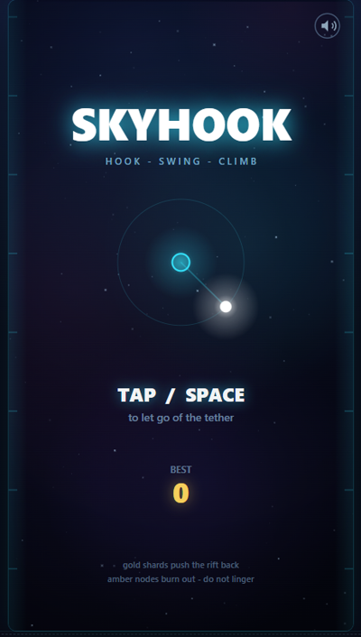
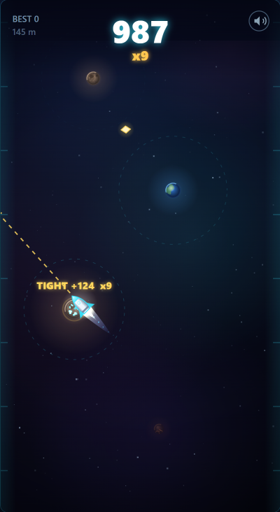
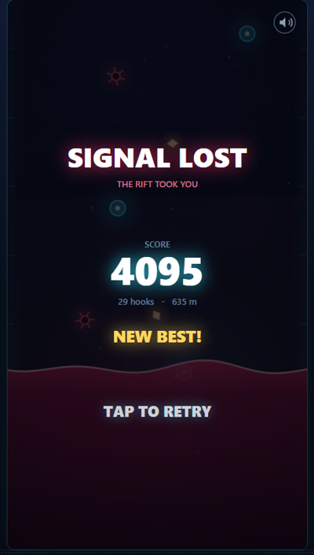

# SKYHOOK

A one-touch neon climbing arcade game. Fly a rocket: tether it to a planet or a star, swing, then fire the thruster to let go and latch onto the next body. The climb is endless -- as long as you stay on screen.

**[▶ Play it here](https://leopechnicki.github.io/skyhook/)** — no install, works on desktop and mobile.

<p align="center">
  
  
  
</p>

## Concept

Your rocket orbits a celestial body on a tether. Tap (or press Space) to fire the thruster and release -- you fly in a straight line and automatically latch onto the next body you pass near. The hull always points along your velocity, so the launch vector is readable off the ship itself. Miss everything and you drift off the screen, which is the only way the run can end.

**Gravity is real (ish).** Every body has a *mass* and a *radius*, and the orbit is derived from them rather than from one global speed:

```
mu    = G * mass                 standard gravitational parameter
omega = sqrt(mu / r^3)           orbital angular rate  (Kepler)
v     = sqrt(mu / r)  = omega*r  the speed you leave with
```

The relations are the real ones; only the constants are tuned. Consequences you can feel: a **star** (high mass, drawn large, big latch ring) spins you faster *and* slings you roughly 1.6x further than a **planet** (low mass, small, gentle). The tighter you catch a body, the faster it spins you. Every body's circle, latch ring and orbit width scale with its radius, so mass is readable at a glance.

**Core mechanics:**

- **Hook** -- Release at the right angle to aim at the next node. Closer latches ("tight hooks") score more and build your combo multiplier (up to x9).
- **Swing** -- While orbiting, your direction and timing determine where you launch. The single input (tap/space) is all you have.
- **Climb** -- The camera only ever climbs, so the bottom of the screen is a ratchet: every hook permanently raises the floor beneath you. The higher you go the heavier the sky gets -- stars become more frequent and more massive, so the release window keeps tightening. Amber planets burn out on a timer -- don't linger.

**Hazards:**

- **Falling off the screen** -- The only fail condition. Leave the column sideways, or drop through the bottom of the view, and the run ends. There is no timer of any kind: idling on an orbit is safe forever, it just scores nothing.
- **Stars** -- Not a hazard by themselves, but the fastest way to become one. They throw you far enough to overshoot the column if you release late.
- **Meteoroids** -- Tumbling rogue rocks, trailing fire, that appear from about the 12th body up. They sit *off* the direct line between two bodies (bobbing on a small arc), so a clean release is always safe -- only a sloppy wide swing or a greedy detour for a shard clips one.
- **Amber planets** -- Decaying bodies that crumble after ~1.5 seconds, forcing an early release.

**Scoring:**

- Tight hook (latch within 57% of the body's ring): 15 points x combo x mass bonus
- Loose hook: 8 points x combo x mass bonus (combo drops if you latch past 85% of the ring)
- Mass bonus: `1 + (mass - 1) * 0.22`, so a heavy star pays roughly 1.5x a planet
- Gold shard: 25 points x half-combo, and +1 combo

## Controls

| Input | Action |
|---|---|
| Tap / click anywhere | Release the tether (and start / restart a run) |
| `Space`, `Enter`, `W`, `↑` | Release the tether |
| `M` | Toggle mute |

Add `?seed=123` to the URL to replay a deterministic layout.

## How to run locally

Open `index.html` in any modern browser. That's it.

No build step, no dependencies, no server required. The game uses plain `<script>` tags (not ES modules) specifically so it works when opened directly from disk via `file://` protocol. All audio is synthesized at runtime via Web Audio API -- there are no asset files to load.

```
# Option A: just double-click index.html

# Option B: use a local server (if you want localStorage to work reliably)
npx serve .
# then open http://localhost:3000
```

## How to deploy

SKYHOOK is a fully static site -- four JS files, one CSS file, one HTML file. No server-side logic.

**GitHub Pages** (how the live build above is hosted):
1. Push this folder to a GitHub repo.
2. Settings > Pages > Source: Deploy from a branch > `main` / `/ (root)`.
3. The game is live at `https://<user>.github.io/<repo>/`.

**Netlify:**
1. Drag-and-drop this folder onto [app.netlify.com/drop](https://app.netlify.com/drop).
2. Done. No build command needed.

**itch.io:**
1. Zip the contents of this folder (index.html at the root of the zip).
2. Upload to [itch.io](https://itch.io) as an HTML game.
3. Set viewport dimensions to 480x880 (the game's logical resolution).

**Any static host:** Upload `index.html`, `css/`, and `js/` to any web server or CDN. No configuration needed.

## Ad slot

The game ships with **no ads and no ad-network code**. There is a single reserved
mount point -- the `<aside id="ad-slot">` element at the bottom of `index.html` --
and it is **hidden by default** (`#ad-slot { display: none; }` in `css/style.css`),
so the shipped game shows no empty banner furniture.

To activate a banner later:

1. Delete the `#ad-slot { display: none; }` rule in `css/style.css`.
2. Put your ad unit markup inside `#ad-slot-inner`.
3. Add the ad network's loader script at the bottom of `<body>`, after the game scripts.

The slot then reserves a fixed height (54px on mobile, 96px on wide screens), so the
banner appears with zero layout shift (CLS). It is the only place an ad unit should
ever be inserted -- no publisher IDs, no external scripts, and nothing tracking-related
exists anywhere else in the codebase.

## Global leaderboard (live, and optional)

`js/config.js` is filled in, so the deployed game at
<https://leopechnicki.github.io/skyhook/> has a LEADERBOARD button, accounts, and
globally ranked runs. Signing up asks for a username, an email and a password --
nothing else. Sign-in is email/password, and a forgotten password is not a dead
end: **Forgot password?** on the sign-in form mails a one-time link that brings
the player back into the game on a SET A NEW PASSWORD form. That flow needs the
origin allow-listed in Supabase (**Authentication -> URL Configuration**), which
is step 3.5 of the setup doc below. The "Continue with Google" button is
drawn only when `googleSignIn: true` in `js/config.js`, which you should set
only after actually enabling Google as a provider -- a button pointing at a
disabled provider navigates the player out of the game onto a raw GoTrue JSON
error rather than failing politely. Google is not enabled on the deployment
above, so that button is not drawn there.

**Accounts remain optional, in both directions.** Playing never requires one: a
run, a local high score and the whole game work signed out. And blanking the two
strings in `js/config.js` turns the feature off entirely -- SKYHOOK then makes no
network request of any kind, draws no account UI, and keeps high scores in
localStorage exactly as it always has, including from a double-clicked
`index.html` with no server and no internet. That off path is a CI gate, not a
claim: `test/leaderboard_ui.mjs` loads the game with an empty config and fails the
build if a single request leaves the page.

Setting up your own project is five steps:
**[docs/LEADERBOARD_SETUP.md](docs/LEADERBOARD_SETUP.md)**.

All the security lives in `supabase/schema.sql`, because the anon key is public by
design and the client is therefore entirely attacker-controlled. Row Level Security
is on for every table; a player may insert only rows carrying their own `auth.uid()`
and may never update or delete a score, not even their own; the public board is a
view exposing username, score and run stats only, and no email address is reachable
from the game at all. Impossible scores and submission flooding are rejected by
CHECK constraints and a BEFORE INSERT trigger -- under every write path, not in an
RPC that could be stepped around.

If the backend is unreachable or paused, the game does not throw, does not show a
broken login box, still records the local high score, and holds the run for upload
later. That is a gate in CI, not an intention -- see `test/leaderboard_ui.mjs`.

## Architecture

| File | Lines | Purpose |
|---|---|---|
| `index.html` | 138 | Shell: canvas, ad slot, script loading |
| `css/style.css` | 366 | Layout only (all game visuals are canvas-drawn) |
| `js/utils.js` | 145 | Math helpers, PRNG, localStorage wrapper, particle system, glow sprites |
| `js/audio.js` | 159 | Fully synthesized audio via Web Audio API (no sample files) |
| `js/celestial.js` | 879 | Body ART only: planet formation classes, spectral star colours, meteoroid rocks. Sprite-cached, zero physics |
| `js/rocket.js` | 396 | Player ART only: hull sprite, heading, thruster plume. Sprite-cached, zero physics |
| `js/game.js` | ~1910 | Core game: celestial bodies, gravity, orbiting, flying, latching, meteoroids, shards, rendering |
| `js/main.js` | 187 | Bootstrap: canvas fitting, input handling (pointer + keyboard), main loop |
| `js/config.js` | 37 | Supabase project URL + **anon** (public) key. Committed on purpose -- GitHub Pages serves the repo, so an uncommitted config does not exist on the live site. Blank both strings to go offline |
| `js/online.js` | 723 | Accounts, sessions and score submission over plain `fetch` (no SDK, no CDN script, no build step) |
| `js/ui_online.js` | 388 | The leaderboard/auth overlay. Inert unless there is a configured backend AND an http(s) origin |
| `supabase/schema.sql` | 313 | Tables, RLS policies, plausibility CHECKs, rate-limit trigger, public board view |
| `test/smoke.mjs` | 372 | Playwright end-to-end smoke test |
| `test/balance.mjs` | 532 | Headless difficulty/balance harness (no browser) |
| `test/world.mjs` | 185 | Golden world-stream gate: proves an art change did not move the simulation |
| `test/online.mjs` | 667 | Online layer in a vm sandbox with a scripted fetch: offline default, payloads, auth, and the schema's security rules |
| `test/leaderboard_ui.mjs` | 545 | The account layer in a real browser against a mock Supabase -- plus an explicitly config-less build and a dead backend |

Runtime dependencies: none. The only dev dependency is Playwright, and only for the smoke test.

## Tests

```
npm install          # only needed once, pulls Playwright for the smoke test
npx playwright install chromium

npm run test:smoke     # node test/smoke.mjs          - 25 end-to-end checks
npm run test:headed    # node test/smoke.mjs --headed - watch the bot play
npm run test:balance   # node test/balance.mjs        - difficulty sweep
npm run test:world     # node test/world.mjs          - golden world stream (fast, pass/fail)
npm run test:art       # node test/art_shots.mjs      - planet/star/meteoroid contact sheets
npm run test:rocket    # node test/rocket_shots.mjs   - rocket orientation + thruster + frame time
npm run test:online    # node test/online.mjs        - accounts/wire protocol, no browser (fast)
npm run test:leaderboard # node test/leaderboard_ui.mjs - account overlay in a real browser
npm run test:ci        # everything CI runs, in CI's order
npm run shots          # node test/shipping_shots.mjs - regenerate README + og:image shots
```

`test/world.mjs` is the gate that keeps an art pass honest. Everything visual is
generated from one seeded RNG chain, so a single stray `rand()` taken for a visual
detail would silently regenerate the whole world. It records every body, hazard and
shard for four seeds into a golden fixture and asserts byte-equality, which is a
faster and stronger statement than re-running the balance sweep.

`test/smoke.mjs` spins up a local HTTP server, boots the game in a real browser (Google Chrome if installed, otherwise Playwright's bundled Chromium), runs an in-page bot that plays through the real input path, and verifies the full lifecycle: title screen, gameplay (hooks, scoring, combos), game over, restart, localStorage persistence, mute toggle, keyboard (SPACE starts a run and fires the thruster, M mutes), ad slot hidden and ad-code-free, mobile viewport, `file://` protocol, and a clean console. It writes screenshots to `test/screenshots/` (git-ignored).

`test/balance.mjs` loads the real game logic into a DOM stub and simulates hundreds of runs at fixed 60 Hz across four synthetic skill profiles, then prints score distributions, death causes, and run lengths. It is a reporting tool, not a pass/fail gate.

## Browser support

Any browser with Canvas 2D and Web Audio API (Chrome, Firefox, Safari, Edge -- all modern versions). Designed mobile-first with `touch-action: none` and `viewport-fit=cover` for fullscreen on iOS. Falls back gracefully when localStorage is unavailable (e.g. `file://` on some Chromium builds).

## License

MIT -- see [LICENSE](LICENSE).
